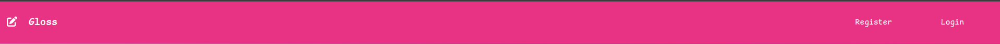
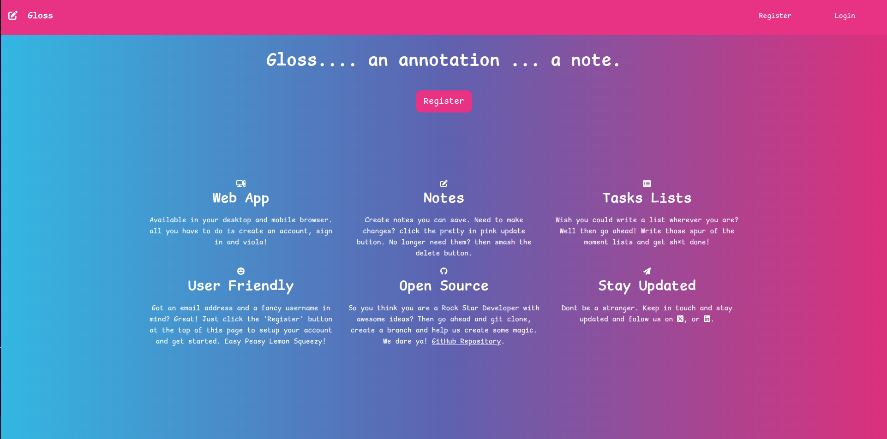
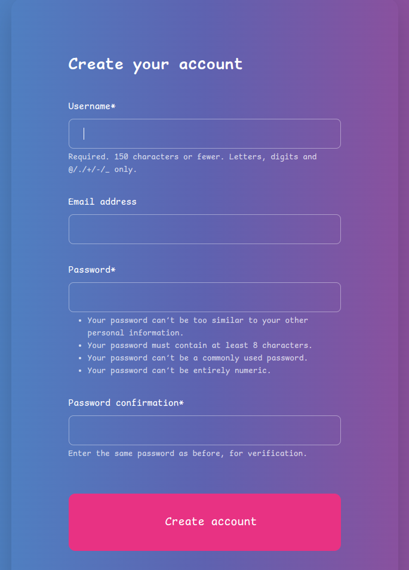
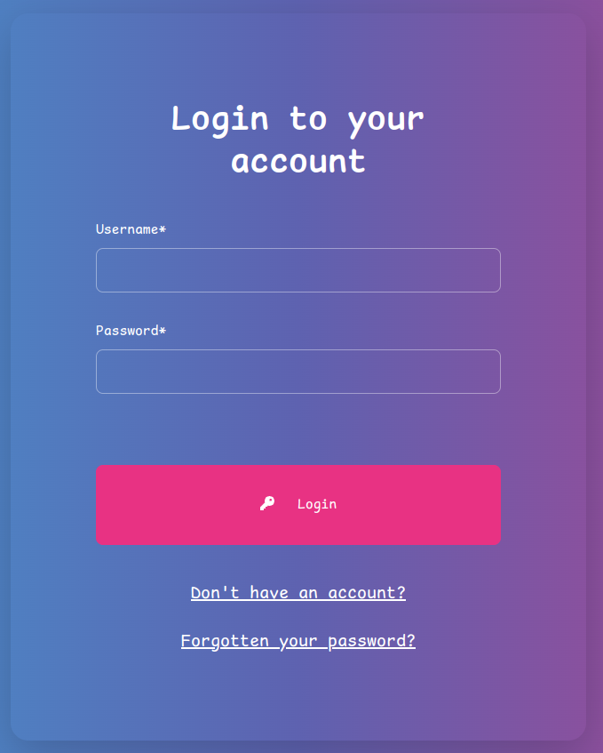

# Gloss

Description

[**Live site**](https://gloss-37a7c75fa1bb.herokuapp.com/)

## Content

- [Gloss](#gloss)
  - [Content](#content)
  - [Project Goals](#project-goals)
    - [User Goals](#user-goals)
    - [Site Owner Goals](#site-owner-goals)
    - [User Stories](#user-stories)
  - [Agile Planning](#agile-planning)
  - [Features](#features)
    - [Navbar](#navbar)
  - [Home page](#home-page)
    - [Register Form](#register-form)
    - [Login page](#login-page)
    - [Dashboard](#dashboard)
    - [Profile Management](#profile-management)
  - [Profile picture](#profile-picture)
  - [Testing](#testing)
  - [Validators](#validators)
  - [Heroku Deployment](#heroku-deployment)
  - [Run Locally](#run-locally)
  - [Technologies](#technologies)
  - [External Python Modules](#external-python-modules)
  - [Planning](#planning)
    - [Wireframes (Canva)](#wireframes-canva)
  - [Database schema and Draw IO](#database-schema-and-draw-io)
  - [Security](#security)
    - [Cross-Site Request Forgery (CSRF) Protection](#cross-site-request-forgery-csrf-protection)
    - [Django Allauth for Authentication and Authorization](#django-allauth-for-authentication-and-authorization)
    - [Restricted Features for Authenticated Users](#restricted-features-for-authenticated-users)
  - [Credits](#credits)

## Project Goals

### User Goals

- Read about the Bluey tv show and the Longdog easter eggs
- Interact with other users by liking and commenting on blogposts.
- Easily navigate the platform and access relevant information.
- Have a visually appealing and responsive user interface.

### Site Owner Goals

- Create a intertesting blog about the Longdogs and Bluey.
- Engage users by providing valuable content and features.
- Increase user retention through interactive features and personalized experiences.

### User Stories

Following user stories was implemeneted in the project:

- As a Site Admin I can delete users so that I can manage my websites users
- As a Site Admin I can create, read, update and delete notes in order to manage site content.
- As a user I can edit and delete my notes.
- As a user I can open notes in order to read them.
- As a user I can create notes on my dashboards.
- As a user I can create an account in order to create, read, update and delete notes.
- As a user I can go to Home page to find information about site, open source and social media accounts.
- As a user I can use the Profile Manager in order to update my username, password and profile picture.

Following user stories was not implemented and labeled as "Future Ideas"

- As a admin of the site, I can...
- As a user, I can..
- As a user I can...
- As a user, I can receive push notifications for new notes....
- As a user, I can bookmark notes and create a collection of notes according to category and/or date.

## Agile Planning

[Link to the user stories project](https://github.com/users//projects/)

## Features

### Navbar

**Fully responsive navbar with links to:**

    - Home page
    - About page
    - Register section
    - Login section
    - Contact Section
    - Likes (If user is autenticated)

**Logo hyperlinked to home page:**

Featured on all pages across the site.

The navbar will adapt based on whether or not the user is authenticated or non-authenticated. (When logged in Login and Register will be hidden and Logout will be displayed in the navbar.)

**Navbar for non-authenticated users**:

**Navbar for authenticated users**:

**_Purpose of feature:_**
Provide users with an easy and straight-forward way to navigate the site

**_Purpose of feature:_**
Provide users with a way to connect with Gloss Developers and check out Gloss' GitHub profile and social media accounts.

## Home page

**The Home page consists of:**

    -  Six short paragraph sections in a responsive grid, summerizing crucial information in a concise manner.
    -A Register button for ease of use.

**_Purpose of feature:_**
Provide users with a welcoming landing page with concise information and a "call to action" Register button.

### Register Form

The fields the user needs to fill in is:

- Userame
- Email Address
- Password

_Additional_: All of the fields are required to be filled in, if it's not the user will be prompted to fill in the field before sending.
The email field needs to contain an email with @ in it to be sent.

**_Purpose of feature:_**
Provide users with form in order to register for an account.

### Login page

The login form allows the user to enter their credentials and authenticate to enter the sites authenticated state.

The login form also contains a link to the  in case the user is not already registered.

### Dashboard

**The Dashboard page consists of:**

    - Profile name
    - Profile picture

### Profile Management

## Profile picture

## Testing

The website has been manually tested and everything has been documented in the testing.md file.

Click here to go to: [Testing and validation](testing.md)

## Validators

All validation can be found in the testing.md file.

Click here to go to: [Testing and validation](testing.md)

## Heroku Deployment

The site was deployed to Heroku. The steps to deploy are as follows:

- Navigate to heroku and create an account
- Click the new button in the top right corner
- Select create new app
- Enter app name
- Select region and click create app
- Click the resources tab and search for Heroku Postgres
- Select hobby dev and continue
- Go to the settings tab and then click reveal config vars
- Add the following config vars:
  - AWS_SECRET_ACCESS_KEY: (Your secret key)
  - AWS_ACCESS_KEY_ID: (This should already exist with add on of postgres)
  - EMAIL_HOST_USER: (email address)
  - EMAIL_HOST_PASS: (email app password)
  - CLOUNDINARY_URL: (cloudinary api url)
- Click the deploy tab
- Scroll down to Connect to GitHub and sign in / authorize when prompted
- In the search box, find the repositoy you want to deploy and click connect
- Scroll down to Manual deploy and choose the main branch
- Click deploy

The app should now be deployed.

## Run Locally

~~~bash

# Clone the project

  git clone https://github.com/CodeConnoisseur74/gloss.git

# Go to the project directory

  cd gloss

# Install dependencies

  pip3 install -r requirements.txt

# Start the server
  python3 manage.py runserver

~~~

Note that you will have to setup your own database and API connections using these steps:

1. Create a file name "env.py" in the projects root directory.
2. Copy and paste this code in the env.py file and replace values with your own:

~~~python

import os

os.environ["AWS_ACCESS_KEY_ID"]=YOUR_AWS_ACCESS_KEY_ID
os.environ["AWS_SECRET_ACCESS_KEY"]=YOUR_AWS_SECRET_ACCESS_KEY
os.environ["AWS_STORAGE_BUCKET_NAME "]=AWS_STORAGE_BUCKET_NAME
os.environ["SECRET_KEY"]=YOUR_SECRET_KEY

~~~

## Technologies

- HTML
  - The structure of the Website was developed using HTML as the main language.
- CSS
  - The Website was styled using custom CSS in an external file.
- Python
  - Python was the main programming language used for the application using the Django Framework.
- GitHub
  - Source code is hosted on GitHub
- Git
  - Used to commit and push code during the development of the Website
- Font Awesome
  - This was used for various icons throughout the site
- Favicon.io
  - favicon files were created at <https://favicon.io/favicon-converter/>
- Canva
  - wireframes were created using Canva <https://canva.com/>

## External Python Modules

- asgiref==3.7.2 - Used for building asynchronous Python web applications, especially with django.
- cloudinary==1.29.0 - Cloundinary was set up for use but no custom uploads were made, settings remain for future development
- crispy-bootstrap5==0.6 - This was used to allow bootstrap5 use with crispy forms
- dj-database-url==0.5.0 - Used to parse database url for production environment
- Django==4.2.10 - Framework used to build the application
- django-allauth==0.57.2 - Used for the sites authentication system, sign up, sign in, logout, password resets ect.
- django-crispy-forms==2.1 - Used to style the forms on render
- gunicorn==20.1.0 - Installed as dependency with another package
- oauthlib==3.2.0 - Installed as dependency with another package
- psycopg2==2.9.9 - Needed for heroku deployment
- python3-openid==3.2.0 - Installed as dependency with another package
- requests-oauthlib==1.3.1 - Installed as dependency with another package (allauth authentication)
- sqlparse==0.4.4 - Installed as dependency with another package
- urllib3==1.26.18 - Installed as dependency with another package
- whitenoise==5.3.0 - Used to serve static files directly without use of static resource provider like cloundinary

## Planning

### Wireframes (Canva)

I created the wireframes for this site with Canva.

<b>Wireframes for desktop</b>

Index

About

Contact

Sign up

Sign in

<b>Wireframes for mobile</b>

Index

About

Contact

Sign up

Sign in

## Database schema and Draw IO

**Data storing**:

[PostgreSQL](https://www.postgresql.org/): Database management system used.

[AWS](https://aws.amazon.com/): For storing image files in the cloud.

## Security

### Cross-Site Request Forgery (CSRF) Protection

- Implementing CSRF protection helps prevent malicious websites from executing unauthorized actions on behalf of authenticated users.
- Django provides built-in CSRF protection by including a CSRF token with each form submission and verifying it on the server side.

### Django Allauth for Authentication and Authorization

- Django Allauth is an authentication and authorization framework that provides features like registration, login, password management, and social authentication.
- It ensures secure user authentication and authorization processes.

### Restricted Features for Authenticated Users

- Certain features, such as creating, editing, or deleting notes , are reserved for authenticated users only.
- By requiring users to be logged in to access these features, the application enhances security and ensures that sensitive operations are performed by authorized individuals only.

## Credits

**Media**:

- [Youtube video](https://www.youtube.com/): I used this video to .

- Fontawesome for icons

**Other Credits**:

- ChatGPT has been used for content text ONLY. No code has been written with ChatGPT

- The

- Thanks to the slack community

- Thanks to 

- A big thank you to my mentor  for the continuing support in all my projects.
